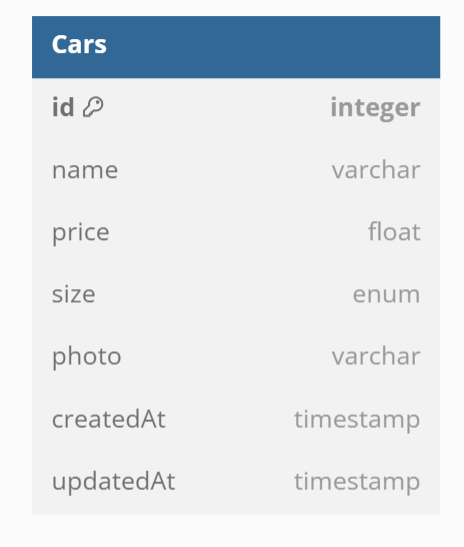

## Car Management Dashboard

### Design Database

### API Testing

| Kategori            | Method | End Poin         | Deskripsi                                                                              |
| ------------------- | ------ | ---------------- | -------------------------------------------------------------------------------------- |
| Get All Data Cars   | GET    | /api/v1/cars     | can req query : "search : "(value = [name car]),"filter" :(value = small,medium,large) |
| Get Data Cars By Id | GET    | /api/v1/cars/:id |                                                                                        |
| Creat Data Car      | POST   | /api/v1/cars     |                                                                                        |
| Update Data Car     | PUT    | /api/v1/cars/:id |                                                                                        |
| Delete Data Car     | DELETE | /api/v1/cars/:id |                                                                                        |

### Link Website

| Deskripsi | Link                       |
| --------- | -------------------------- |
| Dashboard | http://localhost:3000/cars |
